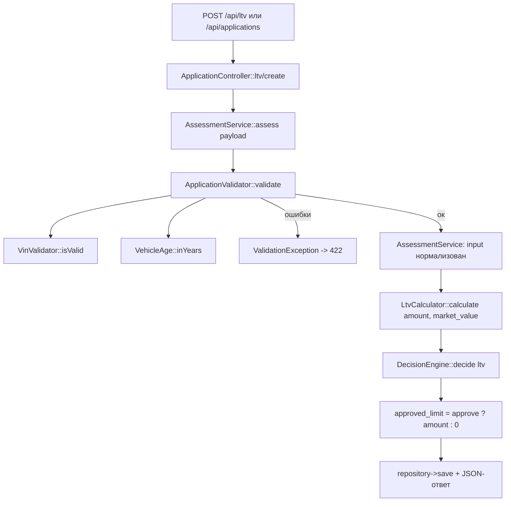

# Как считается решение approve / review / reject: карта кода

Разбор по `backend/src/Domain/` и `backend/config/rules.php` (без изменений кода).

## 1. Как считается решение сейчас

### Участники (все файлы, участвующие в решении)

| Файл | Роль |
|---|---|
| `backend/config/rules.php` | справочник чисел: VIN, vehicle (`min_year`, `max_age_years`, `max_mileage_km`), amount, term, **ltv** (`approve_max`, `review_max`), `ltv_by_age` |
| `backend/src/AppFactory.php` | сборка графа: `new AssessmentService(new ApplicationValidator($rules, new VinValidator($rules['vin']), new VehicleAge(date('Y'))), new LtvCalculator(), new DecisionEngine($rules['ltv']), new VehicleAge(date('Y')))` |
| `backend/src/Http/ApplicationController.php` | `POST /api/ltv` и `POST /api/applications` вызывают `assess()`; `ValidationException` → 422 |
| `backend/src/Domain/AssessmentService.php` | оркестратор `assess()` |
| `backend/src/Domain/ApplicationValidator.php` | нормализация и проверки полей, бросает `ValidationException` |
| `backend/src/Domain/VinValidator.php` | формат VIN (17 символов, A-Z0-9, без I/O/Q) |
| `backend/src/Domain/VehicleAge.php` | возраст = текущий год − год выпуска |
| `backend/src/Domain/LtvCalculator.php` | `round(amount / market_value * 100, 2)` |
| `backend/src/Domain/DecisionEngine.php` | пороги LTV → `approve` / `review` / `reject` |
| `backend/src/Domain/ValidationException.php` | несёт карту `поле => сообщение` |
| `backend/src/Repository/ApplicationRepository.php` | запись в `applications`, `vehicles`, `decisions` |

### Порядок вызовов



Ключевая строка — `AssessmentService.php:32-33`:

```php
$ltv = $this->ltvCalculator->calculate($input['requested_amount'], $input['market_value']);
$decision = $this->decisionEngine->decide($ltv);
```

`DecisionEngine::decide()` (строки 30-41) смотрит **только на LTV**:

```php
if ($ltv < $this->approveMax)  return self::APPROVE;  // < 60
if ($ltv <= $this->reviewMax) return self::REVIEW;   // <= 85
return self::REJECT;
```

Расхождение в коде, которое стоит знать: докблоки в `rules.php:39-41` и `DecisionEngine.php:10-12` обещают `LTV <= 60 -> approve`, но код использует строгое `<`. Фактически LTV ровно 60.0 → `review`. Тесты (`tests/Unit/AssessmentServiceTest.php:47,57,66`) используют 50 / 75 / 95 %, поэтому границу не ловят.

`ltv_by_age` в конфиге есть, но, как написано в `AssessmentService.php:10-12` и `rules.php:50-51`, **не используется** (задача LOAN-12).

---

## 2. Куда встанет правило «пробег > 400 000 → review»

Место: **внутри `DecisionEngine`**, либо — если не хочется менять его сигнатуру — **в `AssessmentService::assess()` сразу после строки 33**. Это единственные две точки, где известны и `decision`, и `mileage`.

Порядок проверок (важно, потому что «review» не должен перебивать «reject»):

1. Считать LTV-решение как сейчас.
2. Если оно `reject` — оставить `reject` (пробег не должен отменять отказ по LTV).
3. Если оно `approve` **и** `mileage > 400000` — заменить на `review`.

Если делать через `AssessmentService`, сигнатуру менять не нужно: `$input['mileage']` уже есть в строке 33, решение лежит в локальной переменной `$decision`. Если делать в `DecisionEngine` («одно место для всех правил решения»), то придётся расширить контракт — сейчас `decide(float $ltv)` получает только одно число, пробега он не видит.

Побочный эффект будет автоматическим: `approved_limit` на строке 39 считается как `approve ? amount : 0`, поэтому при downgrade в `review` лимит станет 0 без дополнительных правок.

### Входные данные, которых уже хватает

- `$input['mileage']` — есть, приведён к `int` валидатором (`ApplicationValidator.php:43`, возвращается на строке 78).
- Пробег приходит из формы (`frontend/index.html:30-31`, `frontend/app.js:8`) и пишется в БД (`vehicles.mileage_km`, `ApplicationRepository.php:38-46`).
- Текущее решение `$decision` / `$ltv` — есть.
- `VehicleAge` уже внедрён в `AssessmentService`, так что конфиг-порог рядом не нарушит конвенцию.

### Чего не хватает

- **Ключа в `rules.php` для порога 400 000.** Сейчас в `vehicle` есть только `max_mileage_km => 500000` — это граница валидации, а не порог решения. Нужен, например, `vehicle.review_mileage_km` (или отдельная секция). По AGENTS.md число нельзя захардкодить в PHP.
- **Способа донести причину review.** В `assess()` нет поля reason, в JSON-ответе контроллера (`ApplicationController.php:44-50, 64-69`) его нет, в таблице `decisions` (`db/schema.sql:30-37`) колонки reason нет — только `ltv`, `decision`, `approved_limit`. То есть заявка уйдёт в `review` без объяснения, почему. Если причина нужна — это правка ответа, репозитория и схемы.
- **Тестов на границу.** В `tests/Unit/DecisionEngineTest.php` и `AssessmentServiceTest.php` случаев 399 999 / 400 000 / 400 001 нет; набор данных передаётся как `payload(amount, market_value)` — на пробег он не параметризуется.
- **Прогноза/эвристики по износу.** Нет.

Отдельно: `docs/spec/spec_MILEAGE.md`, на который ссылаются README, **в репозитории отсутствует** (в `docs/spec/` лежит только `README.md`). Спеки на это правило сейчас нет.

---

## 3. Что уже проверяется про пробег

Ровно одно место — `ApplicationValidator.php:43-46`:

```php
$mileage = (int) ($payload['mileage'] ?? -1);
if ($mileage < 0 || $mileage > $this->rules['vehicle']['max_mileage_km']) {
    $errors['mileage'] = sprintf('Пробег от 0 до %d км', $this->rules['vehicle']['max_mileage_km']);
}
```

То есть 0…500 000 км — валидный диапазон, 500 001+ — 422 `{"errors":{"mileage":...}}`. Это проверка формы, а не бизнес-правило: на `decision` она не влияет никак.

Дополнительно по факту кода:

- При отсутствующем поле подставляется `-1`, что тоже даёт ошибку валидации, а не «пробег 0».
- `(int)`-каст без проверки формата: нечисловой вроде `"abc"` станет `0` и пройдёт как валидный пробег; `"84000 км"` станет `84000`. Проверки на нечисловой ввод — **нет**.
- `mileage` **не** попадает в `LtvCalculator::calculate()` и **не** попадает в `DecisionEngine::decide()` — ни как аргумент, ни как поле входного массива.
- Сведений о пробеге в БД (кроме `mileage_km` в `vehicles`) — **нет**: ни истории, ни сервисных источников, ни проверки по VIN.
- Порогов вида «пробег → review» в коде **нет** вообще.
